# Sơ Đồ Kiến Trúc và Lưu Đồ Thuật Toán
## Hệ Thống So Sánh Hiệu Năng VM và Docker

---

## 1. Kiến Trúc Tổng Thể Hệ Thống

### 1.1. Sơ Đồ Khối Tổng Quan

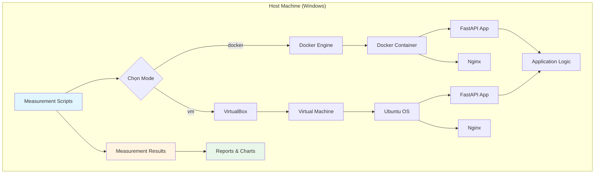

### 1.2. Kiến Trúc Docker Container

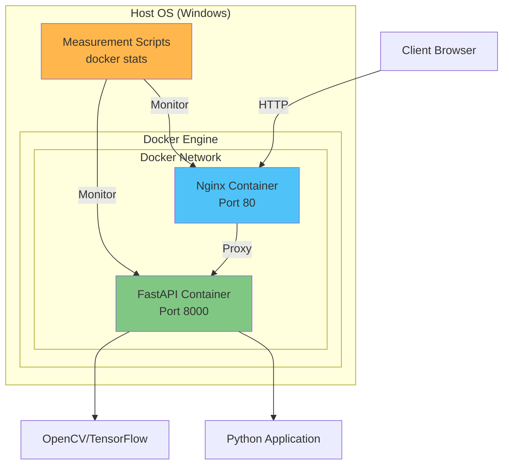

### 1.3. Kiến Trúc Virtual Machine

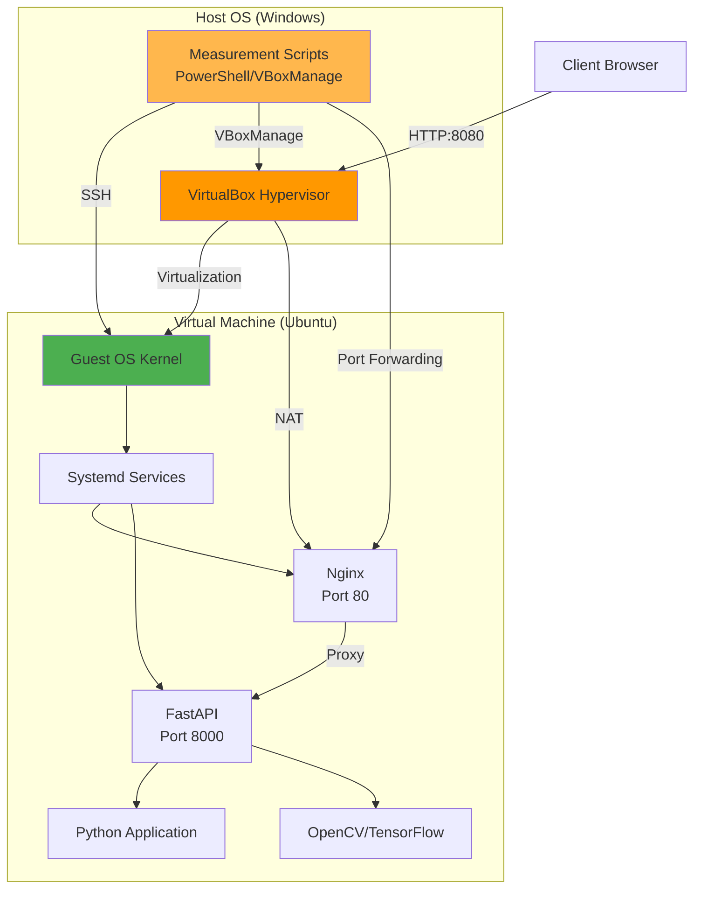

---

## 2. So Sánh Kiến Trúc VM vs Docker

### 2.1. Sơ Đồ So Sánh Cấp Độ Cô Lập

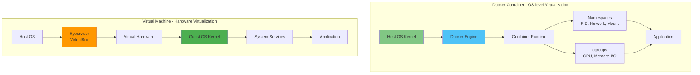

### 2.2. Overhead và Resource Management

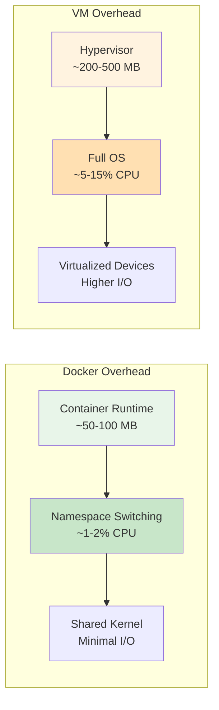

---

## 3. Lưu Đồ Thuật Toán Đo Lường

### 3.1. Lưu Đồ Tổng Thể - Quy Trình Đo Lường

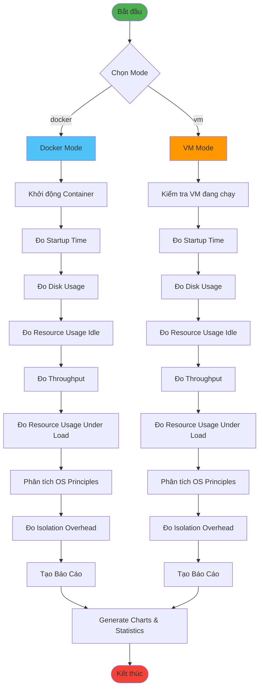

### 3.2. Lưu Đồ Đo Lường Từ Host

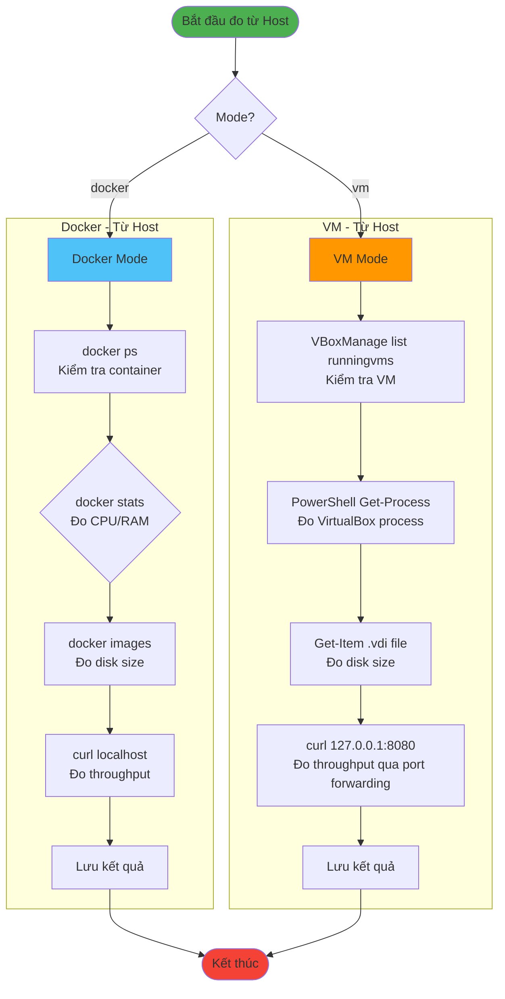

### 3.3. Lưu Đồ Đo Lường Từ Bên Trong

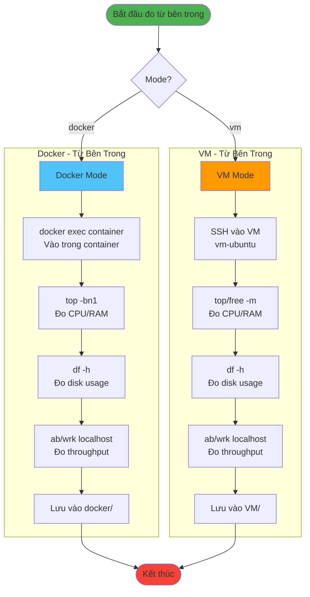

### 3.4. Lưu Đồ Đo Startup Time

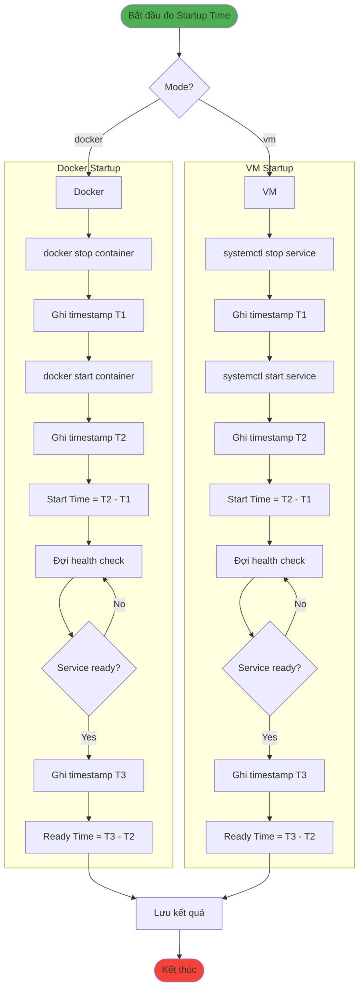

### 3.5. Lưu Đồ Đo Resource Usage

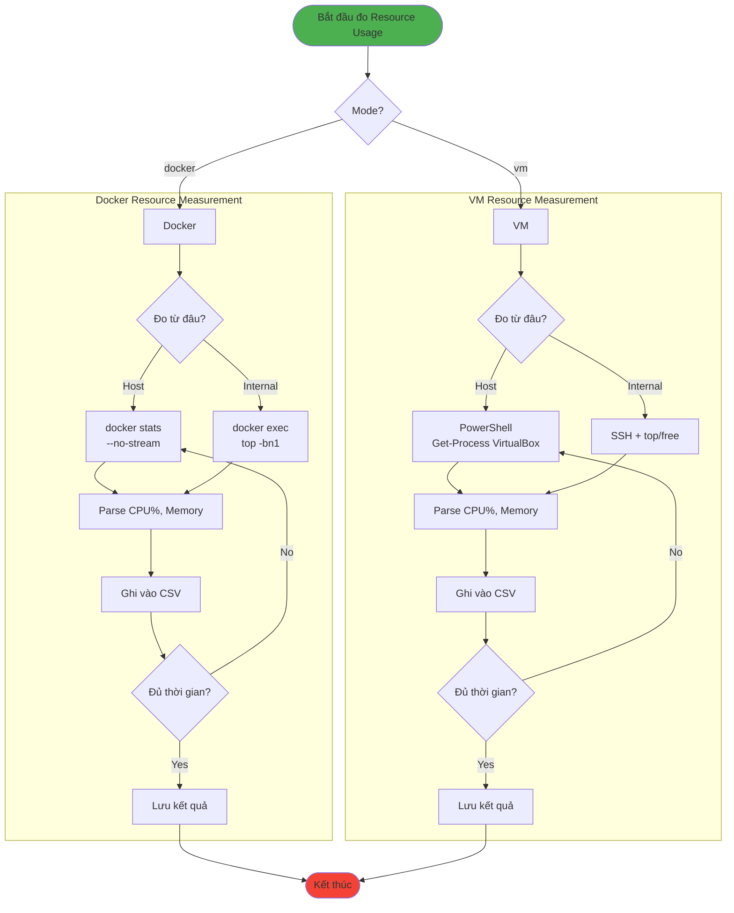

### 3.6. Lưu Đồ Đo Throughput

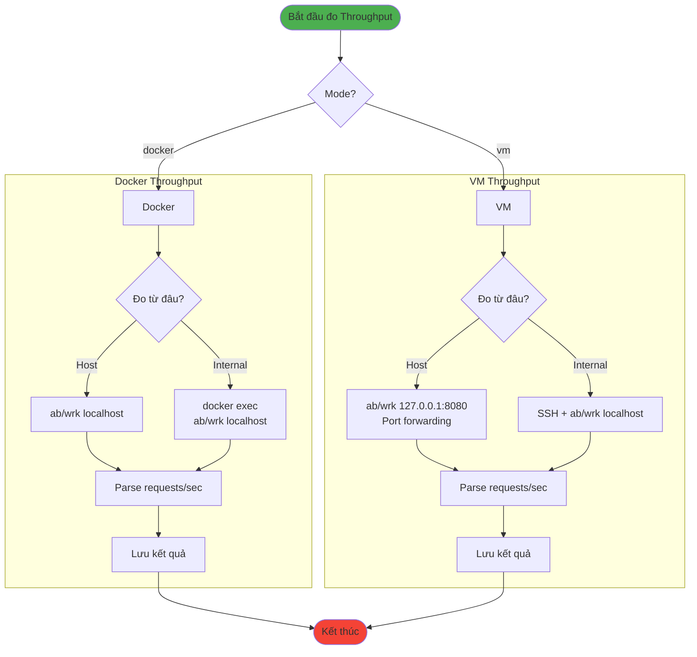

---

## 4. Cấu Trúc Dữ Liệu và Luồng Xử Lý

### 4.1. Cấu Trúc Thư Mục Kết Quả

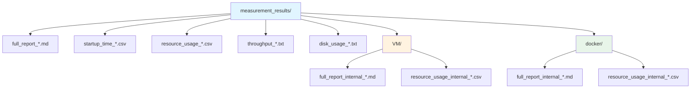

### 4.2. Luồng Xử Lý Dữ Liệu

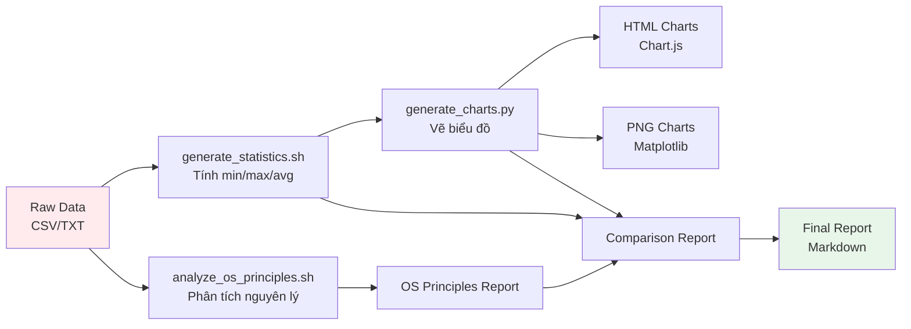

---

## 5. Nguyên Lý Hệ Điều Hành - Resource Management

### 5.1. Docker - cgroups và Namespaces

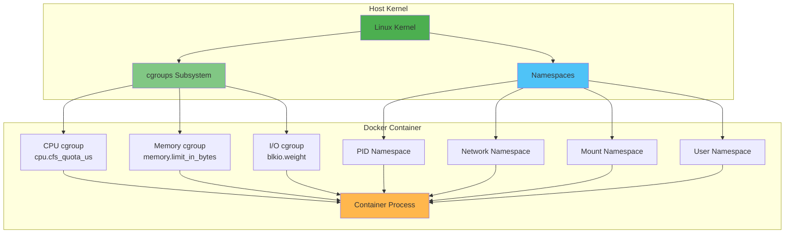

### 5.2. Virtual Machine - Hypervisor

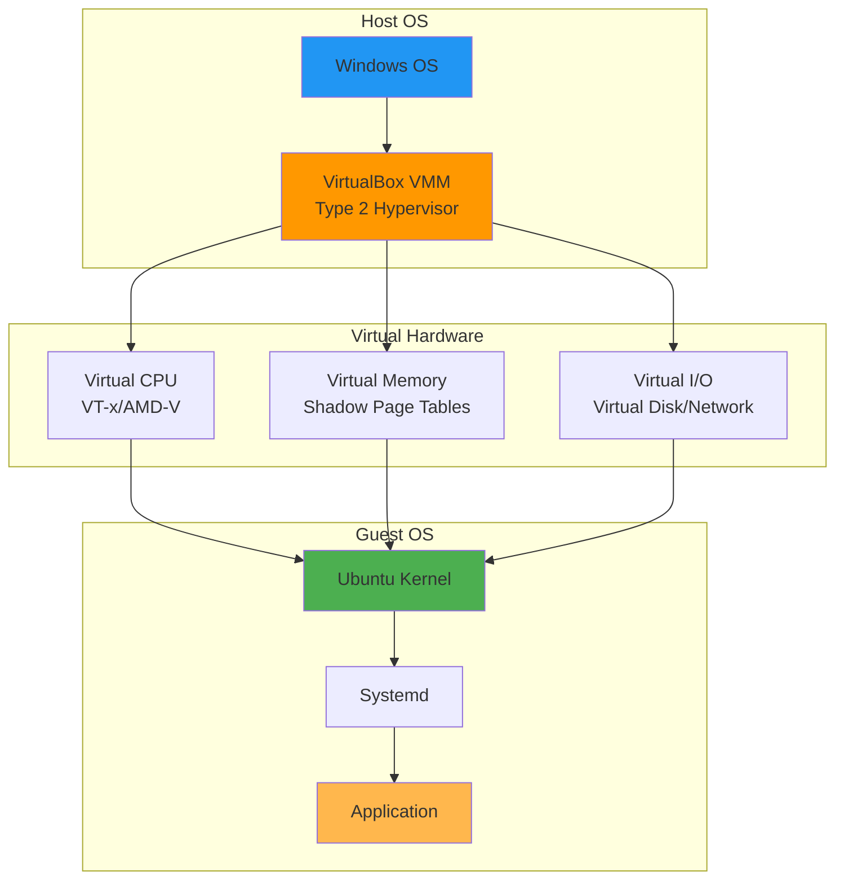

### 5.3. So Sánh Memory Management

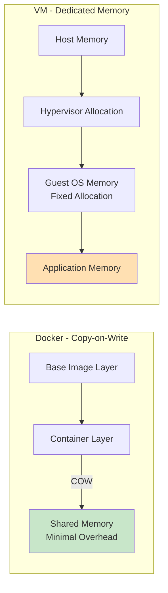

---

## 6. Tóm Tắt Kiến Trúc

### 6.1. Điểm Khác Biệt Chính

| Aspect | Docker Container | Virtual Machine |
|--------|-----------------|-----------------|
| **Virtualization Level** | OS-level | Hardware-level |
| **Kernel** | Shared với host | Kernel riêng |
| **Isolation** | Namespaces + cgroups | Hypervisor |
| **Overhead** | Thấp (~1-2% CPU) | Cao (~5-15% CPU) |
| **Startup Time** | Nhanh (vài giây) | Chậm (vài chục giây) |
| **Memory** | Copy-on-Write | Dedicated allocation |
| **Disk Usage** | Nhỏ (layers) | Lớn (full OS) |

### 6.2. Khi Nào Dùng Gì?

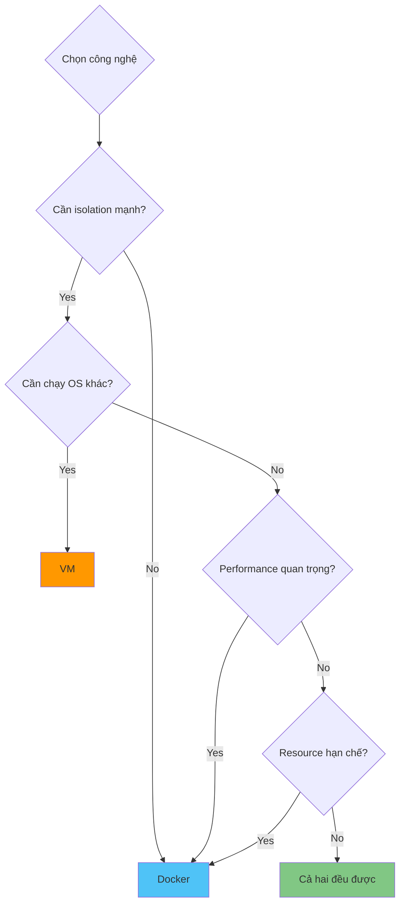

---

## 7. Ghi Chú Kỹ Thuật

### 7.1. Measurement Scripts Architecture

```
scripts/
├── measure_startup_time.sh          # Đo từ Host
├── measure_resource_usage.sh        # Đo từ Host
├── measure_disk_usage.sh            # Đo từ Host
├── measure_throughput.sh            # Đo từ Host
├── measure_isolation_overhead.sh    # Đo overhead
├── analyze_os_principles.sh         # Phân tích nguyên lý
├── generate_charts.py               # Vẽ biểu đồ
├── generate_statistics.sh           # Tính toán thống kê
└── run_all_measurements.sh          # Orchestrator

measurement_results/
├── measure_*_internal.sh            # Đo từ bên trong
├── run_all_measurements_internal.sh # Orchestrator internal
├── VM/                              # Kết quả VM internal
└── docker/                          # Kết quả Docker internal
```

### 7.2. Data Flow

```
Measurement Scripts
    ↓
Collect Raw Data (CSV/TXT)
    ↓
Process & Analyze
    ↓
Generate Statistics
    ↓
Create Charts
    ↓
Generate Reports (Markdown)
    ↓
Final Output
```

---

**Tài liệu này mô tả đầy đủ kiến trúc và thuật toán của hệ thống so sánh hiệu năng VM và Docker.**

